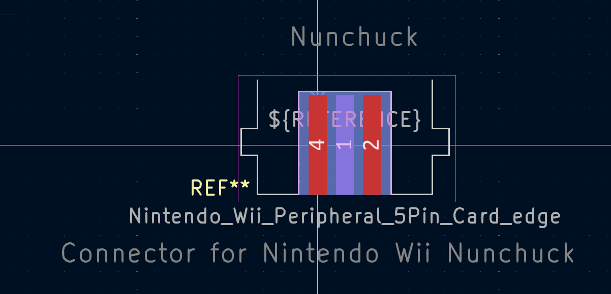
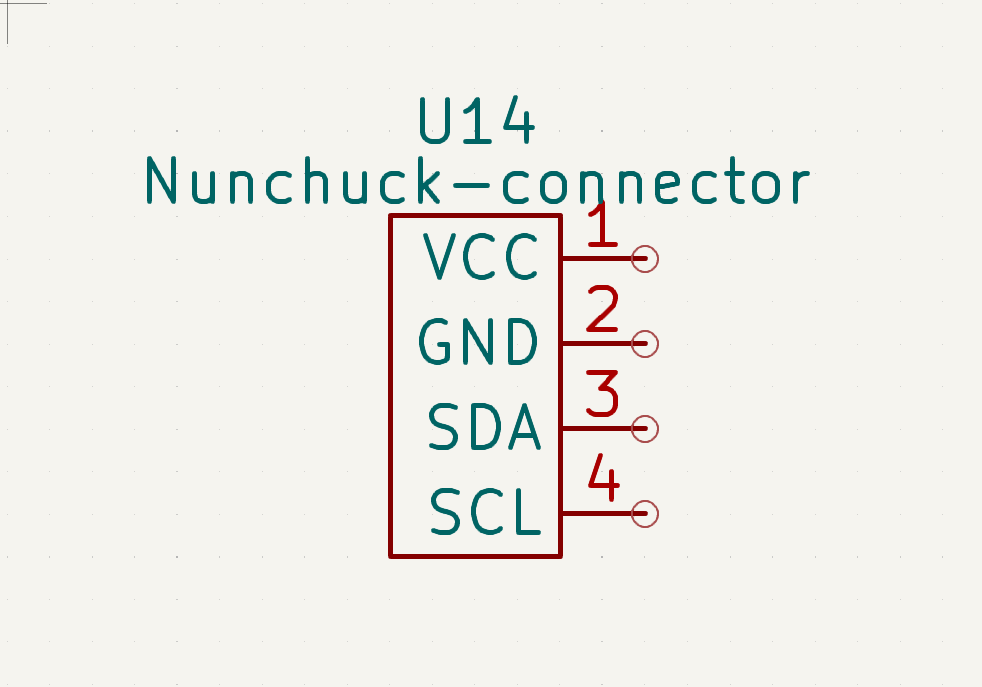

# KICAD NUNCHUCK LIBRARY

## Wii nunchuck connector library for kicad

#### Installation Guide

Clone the repository from GitHub:

download in zip format OR
```bash
git clone https://github.com/rmingon/nunchuck-kicad-lib.git
```
#### Add the library to your KiCad project:

Open your KiCad project.

Go to Preferences > Manage Symbol Libraries.

Add the nunchuck-kicad-lib directory to your library paths.

Repeat for footprints under Preferences > Manage Footprint Libraries.

Assign the 3D model:

Link the included 3D model to your footprint in the PCB editor.


### PCB 


### SCHEMATIC

